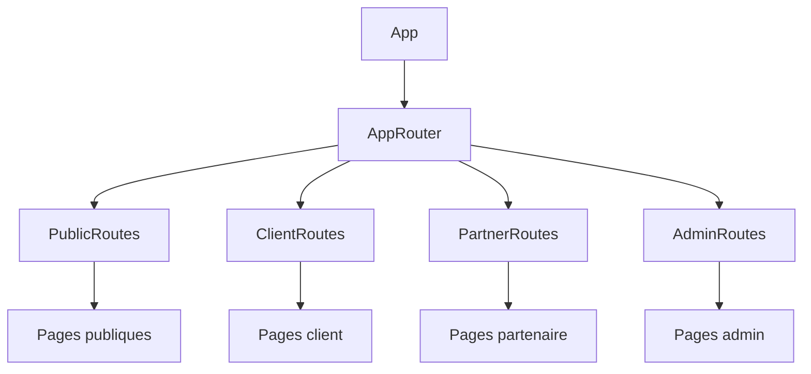

# Architecture de We Event

## Structure Modulaire Optimisée

Notre application est construite avec une architecture modulaire avancée qui permet un chargement dynamique et optimisé des composants. Cette approche améliore significativement les performances et l'expérience utilisateur.



### Modules Principaux

- **Public Routes**: Pages accessibles sans authentification (accueil, connexion, inscription)
- **Client Routes**: Fonctionnalités pour les clients (planification d'événements, gestion des invités)
- **Partner Routes**: Fonctionnalités pour les partenaires (profil, calendrier, services)
- **Admin Routes**: Fonctionnalités administratives (tableau de bord, gestion des utilisateurs)

### Stratégie de Chargement Optimisée

Nous utilisons systématiquement `React.lazy()` et `Suspense` pour charger les modules et composants à la demande, ce qui permet de :

- Réduire significativement la taille du bundle initial
- Améliorer les temps de chargement initial et la performance perçue
- Optimiser l'expérience utilisateur avec des écrans de chargement appropriés
- Réduire la consommation de ressources sur les appareils mobiles

### Exemple de Chargement Dynamique

```typescript
// Chargement paresseux des modules principaux
const PublicRoutes = React.lazy(() => import("@/routes/PublicRoutes"));

// Utilisation avec Suspense pour afficher un état de chargement
<Suspense fallback={<LoadingFallback />}>
  <Routes>
    <Route path="/*" element={<PublicRoutes />} />
  </Routes>
</Suspense>
```

### Principes Architecturaux Clés

- **Séparation des Préoccupations**: Chaque module a une responsabilité unique et bien définie
- **Chargement Conditionnel**: Les composants sont chargés uniquement lorsqu'ils sont nécessaires
- **Isolation des Routes**: Routes protégées par rôle (client, partenaire, admin)
- **Composants de Chargement**: Affichage d'états intermédiaires pendant les imports dynamiques
- **Performance Mobile**: Optimisation spécifique pour les interfaces mobiles via la détection d'appareils

### Avantages de cette Architecture

1. **Performance**: Chargement initial rapide, même sur connexions lentes
2. **Scalabilité**: Facilité d'ajout de nouvelles fonctionnalités sans impacter les performances
3. **Maintenabilité**: Structure claire et organisée par domaine fonctionnel
4. **Expérience utilisateur**: Temps de réponse optimisés et transitions fluides

### Organisation des Fichiers

```
src/
├── components/     # Composants réutilisables
├── routes/         # Configuration des routes par rôle
│   ├── PublicRoutes.tsx
│   ├── ClientRoutes.tsx
│   ├── PartnerRoutes.tsx
│   └── AdminRoutes.tsx
├── pages/          # Pages de l'application organisées par rôle
│   ├── public/
│   ├── client/
│   ├── partner/
│   └── admin/
└── AppRouter.tsx   # Routeur principal
```
