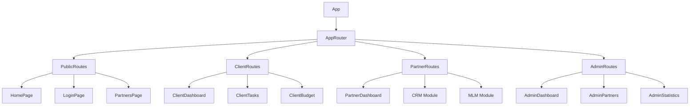
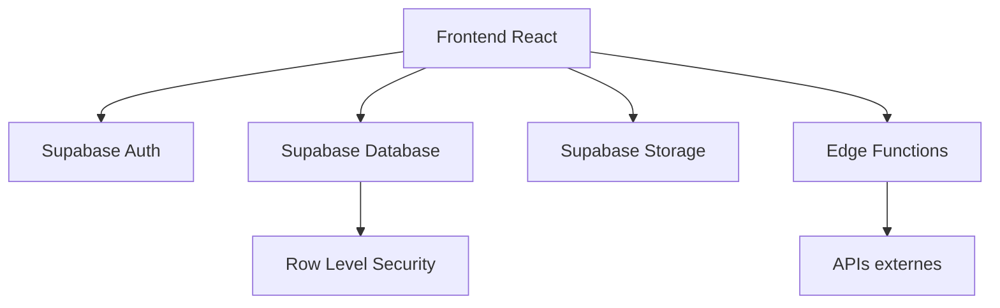
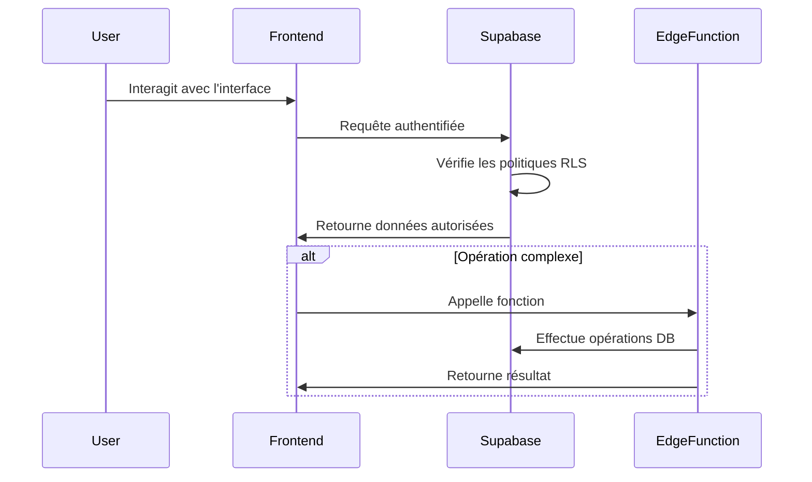

# Architecture de We Event

Ce document présente l'architecture générale de l'application We Event, ses modules fonctionnels et leur interaction avec Supabase.

## Architecture générale

We Event est une application React/TypeScript utilisant Vite comme bundler. L'application est structurée selon une approche modulaire par domaine fonctionnel avec chargement paresseux pour optimiser les performances.

## Architecture frontend

Le frontend est organisé en modules fonctionnels chargés à la demande via React.lazy :

1. **Module Public** : Pages accessibles sans authentification (accueil, connexion, inscription, liste des partenaires)
2. **Module Client** : Fonctionnalités pour les clients (planification, invités, budget)
3. **Module Partenaire** : Fonctionnalités pour les prestataires, incluant le CRM et le MLM
4. **Module Admin** : Fonctionnalités pour les administrateurs (gestion utilisateurs, statistiques)

### Optimisations de chargement

- Chaque module est chargé uniquement lorsqu'un utilisateur y accède
- Les composants dans chaque module sont également chargés de manière paresseuse
- Utilisation de Suspense pour afficher un état de chargement pendant le téléchargement

## Architecture backend (Supabase)

Supabase fournit les services backend suivants :

1. **Authentication** : Gestion des utilisateurs et des rôles (client, partenaire, admin)
2. **Database** : Tables PostgreSQL avec politiques RLS pour la sécurité
3. **Storage** : Stockage de fichiers (images, documents)
4. **Edge Functions** : Logique backend pour les opérations sensibles ou complexes

### Sécurité des données

Les politiques RLS garantissent que :
- Les clients ne voient que leurs propres données
- Les partenaires ne voient que leurs opportunités, demandes, etc.
- Les administrateurs ont accès à l'ensemble des données

## Flux de données

## Stratégie de modularisation

1. **Code splitting** : Utilisation de React.lazy et Suspense pour charger les modules à la demande
2. **Architecture par domaine** : Séparation des fichiers par domaine fonctionnel (client, partenaire, admin)
3. **Composants réutilisables** : Bibliothèque de composants UI partagés entre les modules

Cette architecture permet :
- Un temps de premier rendu optimal
- Un bundle initial réduit
- Une meilleure organisation du code
- Une évolutivité simplifiée

## Extensions futures

L'architecture est conçue pour faciliter l'ajout de nouvelles fonctionnalités :
1. Ajouter un nouveau rôle : créer un nouveau dossier de routes et définir les politiques RLS
2. Ajouter une fonctionnalité : créer les composants et les intégrer dans le module approprié
3. Ajouter une API externe : créer une Edge Function pour l'interaction sécurisée
