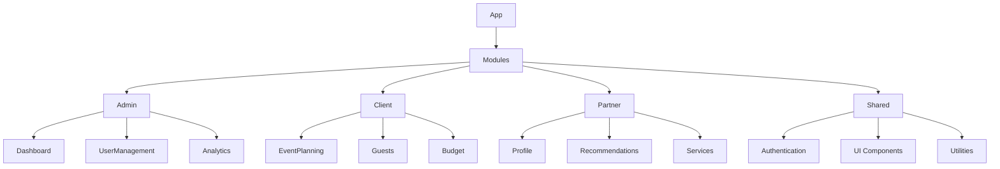

# Architecture de We Event 2.0

## Mise à jour globale de l'architecture

### Structure modulaire améliorée

### Principes architecturaux

1. **Modularité**: Chaque module est découplé et indépendant
2. **Lazy Loading**: Chargement dynamique des modules
3. **Séparation des préoccupations**
4. **Performance**: Optimisation des rendus et des requêtes

### Stratégie de State Management

- Utilisation de React Query pour la gestion des états serveur
- Context API pour les états globaux légers
- Zustand pour les états complexes nécessitant plus de logique

### Sécurité et Authentification

- Authentification via Supabase Auth
- Politiques de Row Level Security (RLS)
- Gestion des rôles et permissions granulaires
- Protection contre les injections et les attaques CSRF

### Performance et Optimisation

- Code splitting
- Memoization avec `useMemo` et `useCallback`
- Lazy loading des composants et des routes
- Optimisation des requêtes avec React Query
- Gestion efficace des re-rendus

### Intégrations Externes

- Supabase (Backend as a Service)
- Stripe (Paiements)
- OpenAI (Assistant IA)
- Google Maps API
- Systèmes de stockage et de médias

## Évolution et Maintenabilité

- Architecture conçue pour une évolutivité horizontale
- Séparation claire entre les couches présentation, logique et données
- Documentation technique et commentaires explicites
- Tests unitaires et d'intégration

## Roadmap Technique

### Tâches Prioritaires

1. **Optimisation des Performances**
   - Implémentation du code splitting par route
   - Mise en place du lazy loading pour tous les composants lourds
   - Optimisation des images et ressources statiques
   - Mise en cache des requêtes API avec React Query

2. **Sécurité et Authentification**
   - Renforcement de la sécurité des routes
   - Implémentation de la validation JWT
   - Mise en place de la protection CSRF
   - Tests de sécurité et audit

3. **Interface Utilisateur**
   - Développement des composants réutilisables
   - Standardisation du design system
   - Implémentation des transitions et animations
   - Support multilingue complet

4. **Gestion des Données**
   - Optimisation des requêtes Supabase
   - Mise en place du cache côté client
   - Implémentation de la synchronisation offline
   - Gestion des conflits de données

5. **Tests et Qualité**
   - Mise en place des tests unitaires
   - Implémentation des tests d'intégration
   - Configuration du CI/CD
   - Documentation technique complète

6. **Fonctionnalités Métier**
   - Système de réservation avancé
   - Gestion des paiements
   - Intégration des fournisseurs
   - Module de reporting

7. **Mobile et Accessibilité**
   - Optimisation mobile-first
   - Support PWA complet
   - Tests d'accessibilité WCAG
   - Support des gestes tactiles

8. **Infrastructure**
   - Monitoring des performances
   - Système de logging
   - Backups automatisés
   - Scale automatique

### Suivi des Progrès

- **En cours**: Optimisation des performances, Sécurité
- **À venir**: Interface utilisateur, Tests
- **Complété**: Architecture modulaire, Lazy loading

### Notes Importantes

- Prioriser la stabilité et la performance
- Maintenir la compatibilité descendante
- Documenter tous les changements majeurs
- Tester sur tous les navigateurs cibles
