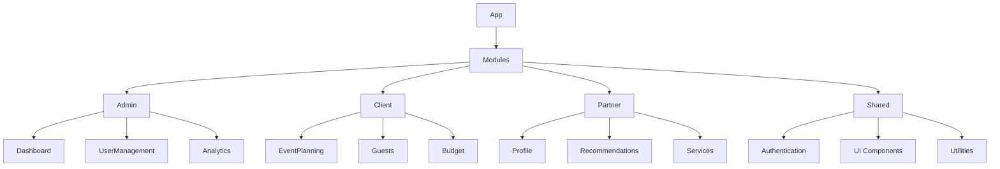

# Architecture de We Event 2.0

## Mise à jour globale de l'architecture

### Structure modulaire améliorée



### Principes architecturaux

1. **Modularité**: Chaque module est découplé et indépendant
2. **Lazy Loading**: Chargement dynamique des modules
3. **Séparation des préoccupations**
4. **Performance**: Optimisation des rendus et des requêtes

### Stratégie de State Management

- Utilisation de React Query pour la gestion des états serveur
- Context API pour les états globaux légers
- Zustand pour les états complexes nécessitant plus de logique

### Sécurité et Authentification

- Authentification via Supabase Auth
- Politiques de Row Level Security (RLS)
- Gestion des rôles et permissions granulaires
- Protection contre les injections et les attaques CSRF

### Performance et Optimisation

- Code splitting
- Memoization avec `useMemo` et `useCallback`
- Lazy loading des composants et des routes
- Optimisation des requêtes avec React Query
- Gestion efficace des re-rendus

### Intégrations Externes

- Supabase (Backend as a Service)
- Stripe (Paiements)
- OpenAI (Assistant IA)
- Google Maps API
- Systèmes de stockage et de médias

## Évolution et Maintenabilité

- Architecture conçue pour une évolutivité horizontale
- Séparation claire entre les couches présentation, logique et données
- Documentation technique et commentaires explicites
- Tests unitaires et d'intégration

## Roadmap Technique

- Migration vers TypeScript strict
- Implémentation de tests automatisés
- Optimisation continue des performances
- Mise à jour régulière des dépendances
- Renforcement de la sécurité

```

