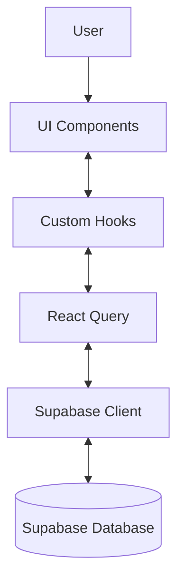

# We Event - Architecture Documentation

## Table of Contents
1. [Overview](#overview)
2. [Application Structure](#application-structure)
3. [Module Structure](#module-structure)
4. [Data Flow](#data-flow)
5. [Authentication](#authentication)
6. [Database Schema](#database-schema)
7. [Component Organization](#component-organization)
8. [State Management](#state-management)
9. [API Integration](#api-integration)
10. [Performance Optimization](#performance-optimization)

## Overview

We Event is a comprehensive event management platform built with React, TypeScript, and Supabase. The application caters to multiple user types:

- **Clients**: End users planning events
- **Partners**: Service providers (venues, caterers, photographers, etc.)
- **Admins**: Platform managers with full access

The architecture follows a modular approach with lazy-loaded routes, component-based design, and role-based access control.

## Application Structure

The application follows a feature-based architecture with the following main directories:

```
src/
  components/        # Reusable components grouped by feature
    admin/           # Admin-specific components
    client/          # Client-specific components
    partner/         # Partner-specific components
    ui/              # Shared UI components (shadcn/ui)
  contexts/          # React context providers
  hooks/             # Custom React hooks
    auth/            # Authentication-related hooks
  lib/               # Utility libraries
  models/            # TypeScript interfaces/types
  pages/             # Page components (route endpoints)
    admin/           # Admin pages
    client/          # Client pages
    partner/         # Partner pages
  routes/            # Route configuration
  utils/             # Utility functions
  integrations/      # Third-party integrations
```

## Module Structure

The application is separated into distinct modules by user role:

### Admin Module
- Dashboard with KPIs
- Partner management
- Content moderation
- System settings

### Client Module
- Event planning tools
- Vendor selection
- Budget management
- Guest management

### Partner Module
- Profile management
- Service showcase
- Booking management
- Analytics

## Data Flow

We Event uses a combination of server-state (via Tanstack Query) and client-state:

1. Data originates from Supabase database
2. API calls are made through Supabase client
3. Server state is managed by React Query
4. UI components consume and update data through hooks
5. Real-time updates utilize Supabase's real-time capabilities



## Authentication

Authentication is handled through Supabase Auth with:

- Email/password login
- Social login providers
- Row-level security (RLS) policies
- JWT tokens for API authorization
- Role-based access control

The auth flow is managed through the `useAuth` hook which provides:
- Authentication state
- Login/logout methods
- Role verification
- Permission checks

## Database Schema

Core tables in the Supabase database:

- **profiles**: User profiles with role information
- **partners**: Partner business information
- **ratings**: Client ratings for partners
- **podcasts/talkshows**: Media content
- **partner_images**: Image assets for partners

Each table implements row-level security (RLS) policies to ensure data access is properly restricted based on user roles.

## Component Organization

Components are organized following these principles:

1. **Atomic Design**: Building from small UI elements to complex components
2. **Feature-Based Grouping**: Components grouped by feature
3. **Container/Presentation Pattern**: Separating logic from presentation
4. **Composition Over Inheritance**: Using component composition extensively

## State Management

State is managed at different levels:

- **Local Component State**: For UI-specific state
- **Context API**: For shared state across component trees
- **React Query**: For server state management
- **URL State**: For navigational state

## API Integration

The application primarily integrates with:

- **Supabase**: For database operations and authentication
- **Payment Providers**: For processing payments
- **Storage Services**: For file uploads and media hosting
- **External APIs**: For additional functionality

## Performance Optimization

Performance optimizations include:

1. **Code Splitting**: Using lazy loading for routes and heavy components
2. **Memoization**: Using React.memo, useMemo, and useCallback
3. **Virtualization**: For long lists
4. **Optimistic UI Updates**: For better perceived performance
5. **Image Optimization**: For faster loading times
6. **Efficient Re-renders**: Careful management of component re-rendering

---

This architecture document provides a high-level overview of the We Event platform. For more specific documentation, please refer to the relevant sections in the codebase.
